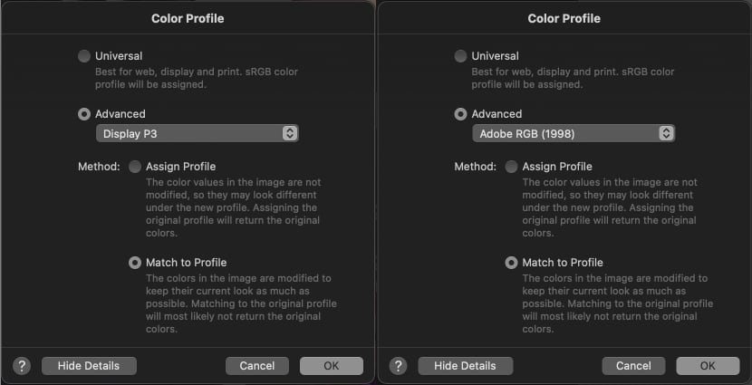

So Whats the deal with color spaces and profiles on JPEG images. Without going too deep I will explain how, and what to do.

For these examples I will be using Pixelmator Pro, but everything say will hold equally true in Photoshop, Gimp or any other image editing software.

First a short description of what color spaces are. A color space defines which colors are available. Some color spaces are very large, and others are more limited. More on this topic can be read here https://en.wikipedia.org/wiki/Color_space , as I do not wish this small post to be exhaustive. 

An image you view on the web are pretty much always in sRGB, unless somebody made a mistake and used for example Adobe RGB instead. Or have a very good reason to use something different. A JPEG is a JPEG right, it will work okay wont it?

Well the image will be displayed, but the colors will have a shift in them and look kind of wrong. Take for example this image:



1. The image on the left, are in Adobe RGB.
2. Displayed in the browser it will look like on the right, because the Browser will just assume it's sRGB, and display it using that profile.

With this specific image, I just realize that this is exactly what I did with it, from 2019 to 2021 this was my profile picture on Github. And I got the profile wrong, should have been sRGB.

>Actually modern browsers are able to correctly display more than one color profile, which means the picture here will show correct in a modern browser. I did not dive deep into this. But there might be some issues with CSS and stuff. Maybe I'll look into this at a later date.

What should we do:
- Always work in sRGB ?
- Always Work in Adobe RGB ?
- Or ProPhoto RGB ?

Really it is your choice! You can do what ever you please. But there are some consequences to choosing each one. Your camera captures color in a color space that is larger than sRGB, so if you choose this space as your working space. You throw out colors, that some professional printers may be able to print. So you actually loose something. 

#### sRGB
- [X] Less colors
- [X] Very compatible, you will be okay everywhere.
- [X] On gradients you may see banding.

>So in sRGB you loose information and you have to go back to your raw file to retrieve it again. Which means you have to redo your edits.

#### Adobe RGB + ProPhoto RGB
- [X] More colors
- [X] Less compatible, using on the web will distort colors.
- [X] Printing may look better on high end printers, due to more color information.
- [X] Less likely to show banding on gradients.

>Where as with Adobe RGB and ProPhoto RGB you keep color information, but you can export to sRGB as needed. This is pretty neat but be sure to always embed the color profile used in your files. Otherwise it will usually just default to sRGB. And keep everybody from guessing the color space. 

What should you use ?

If you are only doing a webshop with product photos, or posting on social media. I would recomend to always work in sRGB, it makes it simpler to not having to work in one color space, and export to another. Remember the Web always expects sRGB!

If on the other hand you are working with finer photograpy, I think Adobe RGB would be the better choice, from a technical perspective. You keep quite a bit extra color information in your photos, and if needed you can always export / convert to a different color space.

> Tip: Ask your prefered printing company which color spaces they can print. And make your decisions from there. If they say sRGB, maybe that would be the natural choice.

So how to work in practice ?

In Pixelmator Pro, when I open a raw file taken on a Canon 60D camera. It automatically assigns the Display P3 16 bit profile (Seen on the left)([see more information here](https://developer.apple.com/videos/play/wwdc2017/821/#:~:text=So%20what%20is%20then%20Display,color%20space%20compared%20to%20sRGB.)) Which is another Color space similar to but not quite as large as Adobe RGB.

As I choose to work in Adobe RGB, I need to convert it to that profile. This is what the same dialog on the right shows. **Match to profile** means that the image will be converted to Adobe RGB from the P3 space. 

> Be aware if you choose the **assign profile** method, you will not convert the colors. You will just tag the picture as being the wrong color space. And the effect will be the same as the example above, where I had an Adobe RGB profile picture on the web. Which will display as an sRGB.

You can use the assign profile if you have an **untagged** image, which you wish to tag with the correct profile, which ever it may be. Pixelmator has pretty good explanations next to your options.

So I say you need to tag the image with the correct color space, what does that mean? Well the image file contains some meta data, which is information contained inside the file it self. So it's not something you need to keep track of and store next to the file. 

This meta data is quite detailed, and can contain which camera and lens took the picture, which settings (ISO etc.). On your mobile phone it most likely will tag the image with the GPS coordinates too, you can view this meta data inside your image editor of choice too.
