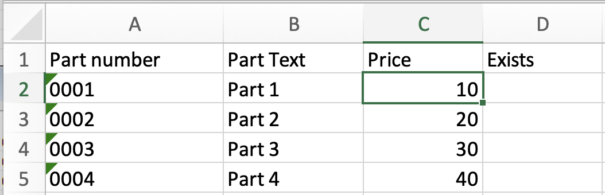
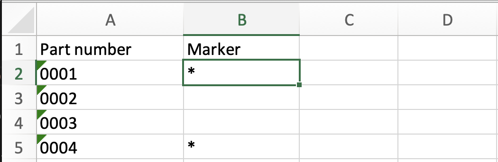
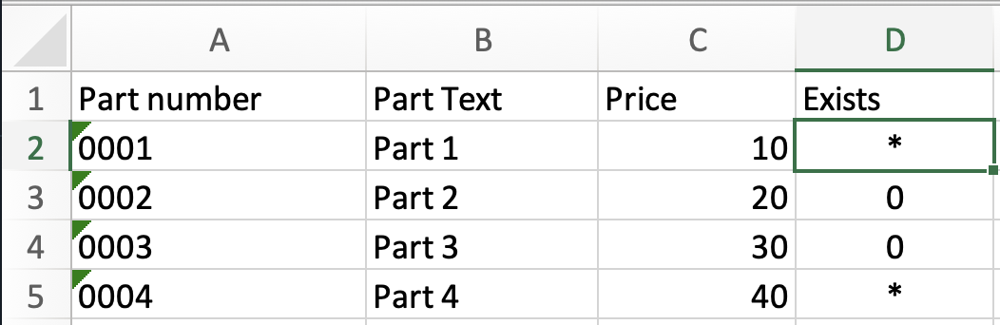

Excel vlookup is super usefull, but I can never remember how to use it. So it's always a struggle, and wastes a lot of time.

#### So we have a small table with parts, on a sheet named "primary:

Note that the last "Exists" column is empty, we wish to populate this from another sheet.

#### Now we have another table, on a sheet named "other":

So we want to make a star in the exists column of the first table, if that partnumber is present in table two.

To do this we need to type in a formula for this join inside the **D2** cell of the primary table:

`=VLOOKUP(A2;other!$A$2:$B$5;2;FALSE)`

Lets break down this formula:
- First we have the equals sign (=), this tells excel that here we have a formula.
- Next comes **vlookup** this is a function name, we pass parameters to this function inside the paranthesis.
  - A2 : Tells Excel that the value in the **A2** cell is our lookup value.
  - `other!$A$2:$B$5` this needs to be broken down too.
     - `other!` means that we will look up the **A2** value from the primary sheet on the other sheet
     - Then we list two cells that form an area.. So `A2:B5` on the other sheet will be our datasource for lookup.
     - The $ signs tells excel that the defined area is fixed. And not a moving window.
  - Now comes 2, this references column B on the other table, where column 1 would be the column b. Remember this area might no be defined such that column 1 incidentially is also A. So this is an index within our defined area.
  - And finally we have a false value. This indicates that our match should be strict.

With our formula defined, we need to copy the formula to all cells in the exsits column. Just copy and paste **D2** into the remaining three cells

#### The primary table now looks like this:

Note how the stars indicate that there is a match.

Admitted not an deep dive into this function, but it will keep me effective next time I need to look up values.

Download the excel file here [File](example.xlsx)